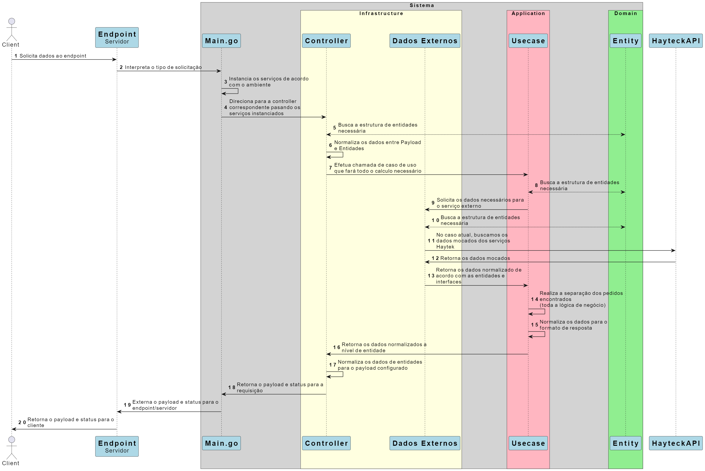

# Separação de pedidos em lotes - API


Microserviço em forma de API para efetuar a separação de de pedidos em lotes, otimizando a utilização de caixas agrupadas por transportadora e cliente.

[Descrição, regras de negócio e referências](https://github.com/haytek-project/test-haytek/blob/main/README.md)


## Instalação e execução do sistema

### Sistema Operacional

> [!NOTE] 
> A instalação e execução deve ser efetuada em um sistema operacional linux Ubuntu. Caso contrário, os comandos abaixo devem ser adequados para o seu sistema operacional.

- Ubuntu 18.04.6 - Ram 1GB - 1 core CPU

### Linguagens / Tecnologias

- Go 1.21
- VSCode
- Swagger 2.0
- Git / Gitbash / GitKraken
- Github

### Preparação do Ambiente

Certifique-se de ter privilégios de superusuário ou utilize `sudo` para executar os comandos.

> [!NOTE]
> Se você não desejar instalar a aplicação, vá direto para "Rodando a Aplicação".

Baixe o projeto para o seu computador. Pode ser pelo git mesmo, mas indico baixar o ZIP e extrair daqui se você não for contribuir com a evolução do projeto e necessitar apenas avaliar.

#### 1. Atualização do Sistema

```
sudo apt-get update && sudo apt-get upgrade
```

#### 2. Instale o golang localmente

```
sudo apt install golang-go
```

#### 3. Atualize o golang

Acesse o [site oficial](https://go.dev/doc/install) do Go e baixe a versão mais recente para o Ubuntu, geralmente um arquivo tar.gz

#### 4. Extração e Instalação

Substitua goX.X.X.linux-amd64.tar.gz pelo nome do arquivo baixado.

```
sudo tar -C /usr/local -xzf goX.X.X.linux-amd64.tar.gz
```

#### 5. Configuração das Variáveis de Ambiente

```
export PATH=$PATH:/usr/local/go/bin
```

#### 6. Verificação da Instalação

Execute o comando para verificar se o Go foi instalado corretamente:

```
go version
```

A versão do Go instalada deve ser exibida.

#### 7. Configuração Opcional (Go Modules)

```
go env -w GO111MODULE=on
```

### Rodando a Aplicação

#### Copie o arquivo de configuração

Vá até o diretório do projeto baixado.

Copie o arquivo de configuração de exemplo

```
cp config-sample.yml config.yml
```

#### Se você deseja rodar o serviço diretamente em golang da sua máquina

Execute o comando para atualizar as dependências

```
sudo go mod tidy
```

Execute o comando para iniciar o servidor

```
sudo go run .
```

> [!NOTE]
> Pode ser necessário alterar a porta em "config.yml"

#### Se você deseja rodar apenas o executável, não é necessário instalar o golang

No linux, execute o comando

```
./HaytekService
```

No windows, abra o arquivo

```
HaytekService.exe
```

Acesse a urk do seu navegador

```
http://localhost:{PortaConfigurada}/v1/delivery-pack
```

## Versão 1.0

#### Fluxo da aplicação

Diagrama de sequência do fluxo de geração de lote



#### Regras Funcionais
- R1. Pedidos enviados dentro de uma mesma data para um mesmo endereço devem ser agrupados em entregas.
- R2. Uma mesma entrega pode conter mais de uma caixa.
- R3. Os pedidos só podem ser agrupados, se forem enviados pela mesma transportadora
- R4. Cada transportadora tem um horário de corte. Pedidos realizados antes do horário de corte, são enviados no mesmo dia.
- R5. Cada transportadora tem um horário de corte. Pedidos realizados após o horário de corte, são enviados no dia seguinte.
- R6. As entregas devem ser agrupados no menor número de caixas possível.
- R7. Usar sempre a menor caixa disponível.
    - R7.1. Pode conflitar com a regra R6.

        Exemplo:
        > Caixa P = 5 itens, Caixa M = 10 itens, Caixa G = 30 itens.<br/>
        > Separação de 11 itens.
        > 
        > Pela regra R6 devemos utilizar a caixa G, pois gera uma menor quantidade de caixas, então, não podemos utilizar a menor caixa disponível pois necessitaria de 2 caixa (P+M).


- R8. A Soma da quantidade máxima de itens das caixas de uma mesma entrega deve ser a menor possível.

    - R8.1. Pode conflitar com a regra R6.

        Exemplo:
        > Caixa P = 5 itens, Caixa M = 10 itens, Caixa G = 30 itens.<br/>
        > Separação de 11 itens.
        > 
        > Pela regra R6 devemos utilizar a caixa G, pois gera uma menor quantidade de caixas, mas gera um volume máximo total de itens = 30.<br/>
        > Para obter a menor soma da capacidade das caixas precisaríamos de uma caixa M e uma P, somando um total de 15 em capacidade.
        > 
        > Então utilizando duas caixas (P+M = 15) temos uma soma de capacidade menor que utilizando apenas uma caixa (G = 30), porém, como a R6 precede a esta, devemos considerar primeiro a R6.

- R9. O mesmo pedido pode ser quebrado em mais de uma caixa, se preciso

#### Requisitos Obrigatórios

- [x] Documentação de como configurar o ambiente e rodar a aplicação no computador do avaliador
- [x] Boas práticas de programação
- [x] Código fácil de entender e manter

#### Requisitos Adicionados
- [x] Microserviço Hexagonal
- [x] Proxy reverso de APIs externas para acesso local no frontend
- [x] Documentação da API com swagger
- [x] Testes de endpoints externos
- [x] Testes da rota no servidor via swagger
- [x] Documentação do fluxo em forma de sequência
- [x] Comandos para build da aplicação

#### Pontos de Atenção
- O sistema não está levando em consideração o volume dos itens
- O sistema não está levando em consideração a capacidade de carga de cada caminhão
- O sistema não possui informações de itens individuais, portanto, não é possível gerar etiquetas isoladas por pacote

#### Observações
- Não se fez necessário a utilização de banco de dados

#### Próximos Passos (versão 1.1+)

- [ ] Consolidar dados externos em banco de dados local
- [ ] Adicionar cache nas requisições externas
- [ ] Efetuar chamadas assíncronas nas APIs externas
- [ ] Adicionar indicadores de desempenho da aplicação
- [ ] Tratar itens individualmente com suas propriedades
- [ ] Adicionar sistema de geração de etiquetas
- [ ] Alterar atributos para público nas entidades
- [ ] Adicionar autenticação de acesso
- [ ] Adicionar limitadores nas APIs externas e internas
- [ ] Adicionar filtros nas APIs externas e internas
- [ ] Compatibilizar a containerização por Docker

